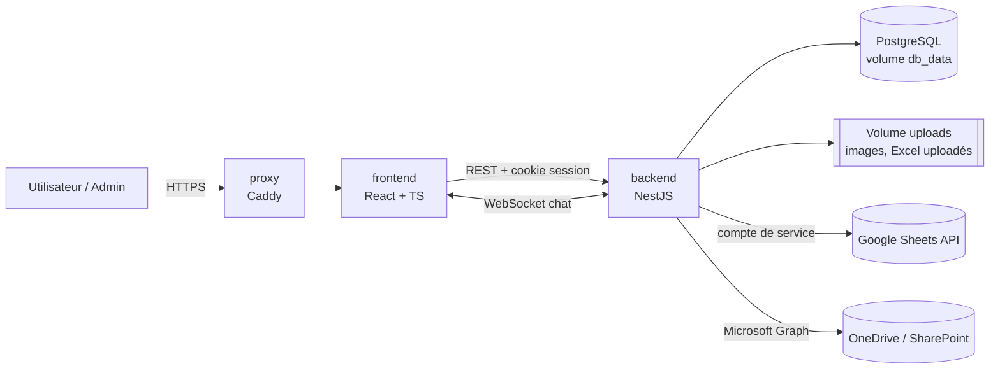
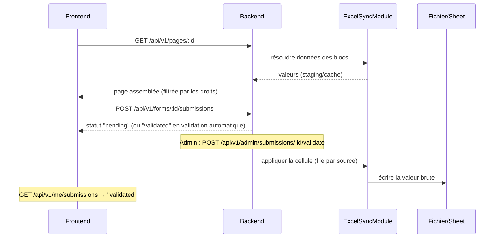

# Architecture

Ce document est le squelette technique de Strategos : il relie les parties de la conception entre elles. Le détail fonctionnel et les règles propres à chaque domaine sont dans [conception/](conception/).

## Sommaire de la conception

| # | Partie | Contenu |
|---|---|---|
| 01 | [Vision](conception/01-vision.md) | Objectif, principe fondateur, profils |
| 02 | [Comptes et authentification](conception/02-comptes-authentification.md) | Sessions, cycle de vie des comptes |
| 03 | [Droits et groupes](conception/03-droits-groupes.md) | Modèle par groupes, calcul des droits effectifs |
| 04 | [Administration](conception/04-administration.md) | Espace admin, visualisation des droits, journal |
| 05 | [Profil utilisateur](conception/05-profil-utilisateur.md) | Page administrative, notes personnelles |
| 06 | [Page builder](conception/06-page-builder.md) | Structure des pages, publication, thèmes, médiathèque, fiches des modules |
| 07 | [Discussions](conception/07-discussions.md) | Espaces de discussion, chat temps réel, modération |
| 08 | [Sources de données](conception/08-sources-donnees.md) | Excel uploadé, Google Sheets, OneDrive, cache, formules |
| 09 | [Formulaires et soumissions](conception/09-formulaires-soumissions.md) | Modification, ajout, validation |
| 10 | [Modèles et duplication](conception/10-modeles-duplication.md) | Bibliothèque de modèles |
| 11 | [Transverse](conception/11-transverse.md) | Stack, suppression, sauvegardes, langue, RGPD |
| 12 | [Parcours](conception/12-parcours.md) | Scénarios de bout en bout qui éprouvent la conception |
| 13 | [API](conception/13-api.md) | Conventions, routes utilisateur et admin, WebSocket du chat, schémas clés |
| 14 | [Modèle de données](conception/14-modele-donnees.md) | Tables, colonnes, index, contraintes, ordre des migrations |

La réalisation est découpée en étapes dans le [plan de réalisation](plan-realisation.md).

## 1. Vue d'ensemble

Quatre conteneurs Docker Compose (proxy Caddy, frontend, backend, base de données). Le backend est le seul point de contact avec les sources de données (Excel uploadés, Google Sheets, OneDrive/SharePoint) — le frontend ne parle qu'au backend, en REST et en WebSocket pour le chat.

## 2. Découpage en modules NestJS

Un module par domaine, chacun avec ses guards et ses DTOs validés via `class-validator` :

- **AuthModule** : session, hash, `AuthGuard` — voir [02](conception/02-comptes-authentification.md).
- **UsersModule** : CRUD des comptes, réinitialisation du mot de passe, désactivation/réactivation — voir [02](conception/02-comptes-authentification.md).
- **GroupsModule** : groupes, appartenance user↔groupe, calcul des permissions effectives et endpoints de lecture des droits — voir [03](conception/03-droits-groupes.md).
- **PermissionsModule** : `PermissionsGuard` réutilisable sur chaque route — voir [03](conception/03-droits-groupes.md).
- **AuditModule** : journal des modifications ; appelé par UsersModule, GroupsModule, ProfileModule, PagesModule, DiscussionsModule, ExcelSyncModule et TemplatesModule — voir [04](conception/04-administration.md).
- **ProfileModule** : page administrative du profil et notes personnelles — voir [05](conception/05-profil-utilisateur.md).
- **PagesModule** : CRUD des pages, brouillon/publication, header/footer partagés, thèmes, médiathèque, soft-delete — voir [06](conception/06-page-builder.md).
- **DiscussionsModule** : espaces de discussion, sujets et messages, pièces jointes images, modération (le chat et sa passerelle WebSocket arrivent à l'étape 9) — voir [07](conception/07-discussions.md).
- **ExcelSyncModule** : cœur technique de la synchronisation Excel/Sheets — voir [08](conception/08-sources-donnees.md) et [09](conception/09-formulaires-soumissions.md).
- **TemplatesModule** : bibliothèque de modèles et instanciation — voir [10](conception/10-modeles-duplication.md).
- **FilesModule** : upload, stockage sur le volume Docker, métadonnées en base — voir [11](conception/11-transverse.md).
- **BackupModule** : sauvegarde quotidienne et téléchargement admin — voir [11](conception/11-transverse.md#sauvegardes).

## 3. Modèle de données

Le schéma complet (colonnes, clés, index, contraintes, ordre des migrations) est dans [14 — Modèle de données](conception/14-modele-donnees.md). Résumé par domaine :

| Domaine | Tables | Partie |
|---|---|---|
| Comptes et sessions | `users`, `sessions`, `login_attempts` | [02](conception/02-comptes-authentification.md) |
| Groupes et droits | `groups`, `user_groups`, `group_permissions` (cible : page **ou** espace de discussion) | [03](conception/03-droits-groupes.md) |
| Instance | `settings` (ligne unique : page d'arrivée, thème par défaut, rétention), `themes`, `media`, `backups` | [04](conception/04-administration.md), [06](conception/06-page-builder.md), [11](conception/11-transverse.md) |
| Pages | `pages` (brouillon et version publiée en JSON), `layout_parts` (header, footer) | [06](conception/06-page-builder.md) |
| Discussions | `discussion_spaces`, `topics`, `topic_messages`, `chats`, `chat_messages`, `message_revisions`, `attachments` | [07](conception/07-discussions.md) |
| Sources | `sources`, `staging_cells` (uploads seulement), `cell_references`, `onedrive_credentials`, `reimport_previews` | [08](conception/08-sources-donnees.md) |
| Formulaires | `forms`, `form_versions`, `submissions` | [09](conception/09-formulaires-soumissions.md) |
| Modèles | `templates` | [10](conception/10-modeles-duplication.md) |
| Profil | `user_notes` | [05](conception/05-profil-utilisateur.md) |
| Journal | `audit_log` (ajout seul, garanti par un trigger) | [04](conception/04-administration.md) |

Conventions : UUID v7, `timestamptz`, suppression douce (`deleted_at`) avec unicités partielles, verrouillage optimiste (`version`), schéma **Prisma** complété en SQL pour les contraintes `CHECK`, les index partiels et le trigger.

Le calcul des droits effectifs (fonction de résolution unique) est décrit dans [03 — Calcul des droits effectifs](conception/03-droits-groupes.md#calcul-des-droits-effectifs).

Soft-delete (`deleted_at`) sur pages, formulaires, espaces, sujets, messages (sujets et chat), chats, groupes, utilisateurs, notes, médias, sources — voir [11 — Suppression de contenu](conception/11-transverse.md#suppression-de-contenu).

## 4. Moteur Excel/Sheets (`ExcelSyncModule`)

- Lecture, cache, liaisons inter-fichiers et écriture : voir [08 — Sources de données](conception/08-sources-donnees.md#points-techniques).
- Validation des soumissions `ajout` (calcul de la ligne, limite de lignes) : voir [09 — Formulaires et soumissions](conception/09-formulaires-soumissions.md#validation-dune-soumission-ajout).

## 5. Frontend (React + TS)

- Rendu piloté par la config JSON des pages via un `BlockRenderer` et un registre de modules — détail dans [06 — Page builder](conception/06-page-builder.md#points-techniques).
- Layout responsive par zones (Header/Main/Sidebar/Footer), breakpoints mobile/tablette.
- Client HTTP simple (fetch/axios) avec session par cookie ; React Query pour le cache des lectures suffit vu l'échelle attendue (pas de state manager lourd).

## 6. Flux clés

## 7. Déploiement

Un seul `docker-compose.yml` : services `proxy` (Caddy, HTTPS automatique), `frontend`, `backend`, `db`, volumes nommés `db_data`, `uploads` et `backups`. Sauvegarde quotidienne et téléchargement depuis l'espace admin ([11](conception/11-transverse.md#sauvegardes)). La clé du compte de service Google est montée comme fichier secret dans le conteneur backend (dossier `secrets/`, ignoré par git, monté en lecture seule) ; les identifiants de l'application Azure passent par des variables d'environnement, et le jeton délégué de l'admin est stocké chiffré en base ([08](conception/08-sources-donnees.md#points-techniques)). Une seule commande (`docker compose up`) pour tout lancer.

## 8. Sécurité transverse

- `PermissionsGuard` appliqué à chaque route (lecture/création) — jamais de vérification uniquement côté frontend.
- Ressource illisible → `404` (jamais `403`, qui révèlerait son existence) ; CSRF par en-tête `X-CSRF-Token` ; tableau complet des protections dans [13 — API](conception/13-api.md#6-qui-protège-quoi).
- Règles propres à chaque domaine :
  - sessions et révocation : [02](conception/02-comptes-authentification.md#points-techniques) ;
  - guard admin et intégrité du journal : [04](conception/04-administration.md#points-techniques) ;
  - accès au profil, notes et XSS : [05](conception/05-profil-utilisateur.md#points-techniques) ;
  - validation des mappings et périmètre d'écriture : [09](conception/09-formulaires-soumissions.md#sécurité).
