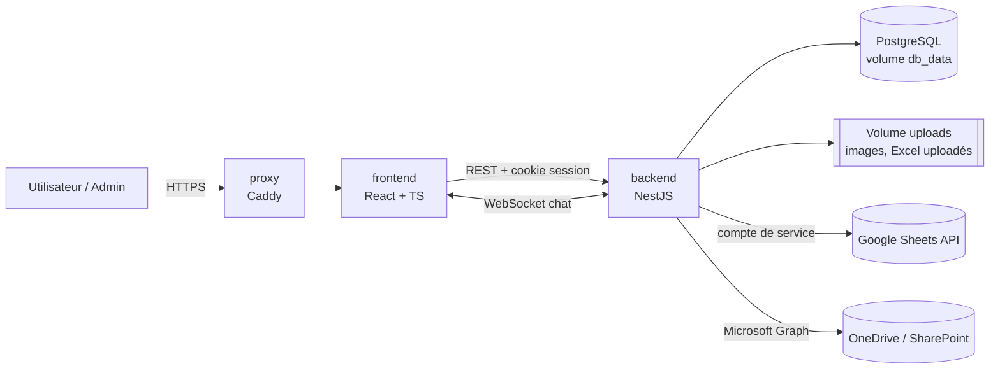
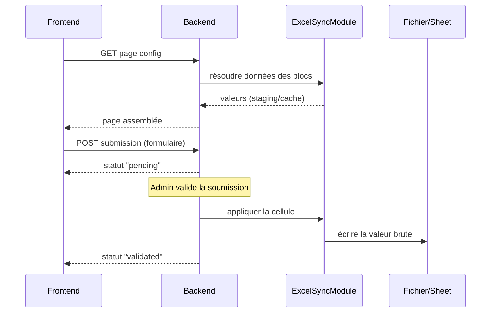

# Architecture

Ce document est le squelette technique de Strategos : il relie les parties de la conception entre elles. Le détail fonctionnel et les règles propres à chaque domaine sont dans [conception/](conception/).

## Sommaire de la conception

| # | Partie | Contenu |
|---|---|---|
| 01 | [Vision](conception/01-vision.md) | Objectif, principe fondateur, profils |
| 02 | [Comptes et authentification](conception/02-comptes-authentification.md) | Sessions, cycle de vie des comptes |
| 03 | [Droits et groupes](conception/03-droits-groupes.md) | Modèle par groupes, calcul des droits effectifs |
| 04 | [Administration](conception/04-administration.md) | Espace admin, visualisation des droits, journal |
| 05 | [Profil utilisateur](conception/05-profil-utilisateur.md) | Page administrative, notes personnelles |
| 06 | [Page builder](conception/06-page-builder.md) | Structure des pages, publication, thèmes, médiathèque, fiches des modules |
| 07 | [Discussions](conception/07-discussions.md) | Espaces de discussion, chat temps réel, modération |
| 08 | [Sources de données](conception/08-sources-donnees.md) | Excel uploadé, Google Sheets, OneDrive, cache, formules |
| 09 | [Formulaires et soumissions](conception/09-formulaires-soumissions.md) | Modification, ajout, validation |
| 10 | [Modèles et duplication](conception/10-modeles-duplication.md) | Bibliothèque de modèles |
| 11 | [Transverse](conception/11-transverse.md) | Stack, suppression, sauvegardes, langue, RGPD |
| 12 | [Parcours](conception/12-parcours.md) | Scénarios de bout en bout qui éprouvent la conception |

## 1. Vue d'ensemble

Quatre conteneurs Docker Compose (proxy Caddy, frontend, backend, base de données). Le backend est le seul point de contact avec les sources de données (Excel uploadés, Google Sheets, OneDrive/SharePoint) — le frontend ne parle qu'au backend, en REST et en WebSocket pour le chat.

## 2. Découpage en modules NestJS

Un module par domaine, chacun avec ses guards et ses DTOs validés via `class-validator` :

- **AuthModule** : session, hash, `AuthGuard` — voir [02](conception/02-comptes-authentification.md).
- **UsersModule** : CRUD des comptes, réinitialisation du mot de passe, désactivation/réactivation — voir [02](conception/02-comptes-authentification.md).
- **GroupsModule** : groupes, appartenance user↔groupe, calcul des permissions effectives et endpoints de lecture des droits — voir [03](conception/03-droits-groupes.md).
- **PermissionsModule** : `PermissionsGuard` réutilisable sur chaque route — voir [03](conception/03-droits-groupes.md).
- **AuditModule** : journal des modifications ; appelé par UsersModule, GroupsModule, ProfileModule, PagesModule, TopicsModule, ExcelSyncModule et TemplatesModule — voir [04](conception/04-administration.md).
- **ProfileModule** : page administrative du profil et notes personnelles — voir [05](conception/05-profil-utilisateur.md).
- **PagesModule** : CRUD des pages, brouillon/publication, header/footer partagés, thèmes, médiathèque, soft-delete — voir [06](conception/06-page-builder.md).
- **TopicsModule** : espaces de discussion, sujets et messages, pièces jointes images, modération, et passerelle WebSocket du chat — voir [07](conception/07-discussions.md).
- **ExcelSyncModule** : cœur technique de la synchronisation Excel/Sheets — voir [08](conception/08-sources-donnees.md) et [09](conception/09-formulaires-soumissions.md).
- **TemplatesModule** : bibliothèque de modèles et instanciation — voir [10](conception/10-modeles-duplication.md).
- **FilesModule** : upload, stockage sur le volume Docker, métadonnées en base — voir [11](conception/11-transverse.md).
- **BackupModule** : sauvegarde quotidienne et téléchargement admin — voir [11](conception/11-transverse.md#sauvegardes).

## 3. Modèle de données (entités clés)

- `users(id, username, password_hash, must_change_credentials, personal_page_id?, disabled_at, deleted_at)`, `groups(id, name, description, deleted_at)`, `user_groups` — `must_change_credentials` force le changement d'identifiants ([02](conception/02-comptes-authentification.md#compte-administrateur))
- `group_permissions(group_id, resource_type[page|discussion_space], resource_id, can_read, can_create_topic, can_post)` — pas de droit d'écriture ; `resource_id` obligatoire (pas de permission « sur tout ») ; page = `can_read` seul ([03](conception/03-droits-groupes.md#points-techniques))
- `settings(landing_page_id, default_theme_id, backup_retention_days, …)` — réglages globaux de l'instance ([04](conception/04-administration.md#réglages-de-linstance)) ([03](conception/03-droits-groupes.md#visibilité-et-page-darrivée))
- `themes(id, name, config JSONB, is_default)` — thèmes nommés ([06](conception/06-page-builder.md#thèmes))
- `pages(id, name, theme_id?, show_header, show_footer, draft_config JSONB, published_config JSONB, published_at, deleted_at)` — config JSON par zone (Main/Sidebar) : rangées de 1 à 3 colonnes, un bloc typé par colonne ; `theme_id` vide = thème par défaut ([06](conception/06-page-builder.md#points-techniques))
- `layout_parts(kind[header|footer], draft_config, published_config, published_at)` — header et footer partagés
- `media(id, filename, path, mime, size, alt, uploaded_at, deleted_at)` — médiathèque
- `discussion_spaces(id, page_block_id, name, sort_mode, deleted_at)`, `topics(id, space_id, author_id, title, closed_at, pinned_at, deleted_at)`, `messages(id, topic_id, author_id, hidden_at, deleted_at, ...)`
- `chat_messages(id, page_block_id, author_id, content, created_at, hidden_at, deleted_at)` — historique du chat conservé
- `message_revisions(message_id, message_kind[topic|chat], content, edited_at, action[edit|delete|hide])` — archive des modifications, suppressions et masquages ([07](conception/07-discussions.md#points-techniques))
- `excel_sources(id, type[upload|gsheet|onedrive], connection_info, last_synced_at, last_downloaded_at)` — `last_downloaded_at` sert à l'avertissement de réimport des uploads
- `excel_staging_cells(source_id, sheet_ref, cell_ref, value, formula?, needs_recalc)` — staging des **Excel uploadés uniquement**, jamais reparsés à chaque affichage ; les sources connectées passent par un cache mémoire ([08](conception/08-sources-donnees.md#points-techniques))
- `cell_references(source_id, sheet_ref, cell_or_range, referenced_source_id, referenced_ref)` — résolution des liaisons inter-fichiers ([08](conception/08-sources-donnees.md))
- `forms(id, page_block_id, fields JSONB, mode[modification|ligne|ajout], is_open, closes_at?, auto_validate, deleted_at)` — `fields` porte pour chaque champ : type, règles, options (liste saisie ou plage source), `auto[pseudo|date]?`, `is_movement` ([09](conception/09-formulaires-soumissions.md#formulaires))
- `form_row_config(form_id, source_id, sheet_ref, range, key_column, linked_block_id)` — formulaire de ligne : plage, colonne clé et tableau/catalogue relié
- `form_add_config(form_id, source_id, sheet_ref, start_row, max_new_rows)` — zone d'ajout `[start_row, start_row + max_new_rows - 1]` d'un formulaire en mode `ajout` (n'existe que pour ce mode) ; les colonnes autorisées sont celles de `form_field_mappings` ; la ligne attribuée est la première ligne vide de la zone ([09](conception/09-formulaires-soumissions.md#validation-dune-soumission-ajout))
- `form_field_mappings(form_id, field_key, source_id, cell_ref)` — pour un formulaire `ajout`, `cell_ref` contient une référence de colonne (ex. `"C"`) plutôt qu'une cellule complète : la ligne est résolue dynamiquement à la validation
- `submissions(id, form_id, user_id, values JSONB, row_key?, status[pending|validated|rejected|modified|invalidated], assigned_row?, validated_by?)` — `row_key` pour un formulaire de ligne ; `assigned_row` rempli à la validation d'un ajout ; `validated_by` vide = validation automatique
- `templates(id, type[form|page|topic], payload JSONB)`
- `user_notes(id, user_id, title, content, created_at, updated_at, deleted_at)` — `content` en format riche restreint, nettoyé côté backend
- `audit_log(id, actor_id, action, target_type, target_id, before JSONB, after JSONB, created_at)` — journal en ajout seul (comptes, appartenances, permissions, soumissions, sources, pages, formulaires, restaurations, consultations de notes — liste complète dans [04](conception/04-administration.md#journal-des-modifications))

Le calcul des droits effectifs (fonction de résolution unique) est décrit dans [03 — Calcul des droits effectifs](conception/03-droits-groupes.md#calcul-des-droits-effectifs).

Soft-delete (`deleted_at`) sur pages, formulaires, sujets, messages, messages de chat, groupes, utilisateurs, notes — voir [11 — Suppression de contenu](conception/11-transverse.md#suppression-de-contenu).

## 4. Moteur Excel/Sheets (`ExcelSyncModule`)

- Lecture, cache, liaisons inter-fichiers et écriture : voir [08 — Sources de données](conception/08-sources-donnees.md#points-techniques).
- Validation des soumissions `ajout` (calcul de la ligne, limite de lignes) : voir [09 — Formulaires et soumissions](conception/09-formulaires-soumissions.md#validation-dune-soumission-ajout).

## 5. Frontend (React + TS)

- Rendu piloté par la config JSON des pages via un `BlockRenderer` et un registre de modules — détail dans [06 — Page builder](conception/06-page-builder.md#points-techniques).
- Layout responsive par zones (Header/Main/Sidebar/Footer), breakpoints mobile/tablette.
- Client HTTP simple (fetch/axios) avec session par cookie ; React Query pour le cache des lectures suffit vu l'échelle attendue (pas de state manager lourd).

## 6. Flux clés

## 7. Déploiement

Un seul `docker-compose.yml` : services `proxy` (Caddy, HTTPS automatique), `frontend`, `backend`, `db`, volumes nommés `db_data`, `uploads` et `backups`. Sauvegarde quotidienne et téléchargement depuis l'espace admin ([11](conception/11-transverse.md#sauvegardes)). La clé du compte de service Google est montée comme fichier secret dans le conteneur backend ; les identifiants de l'application Azure passent par des variables d'environnement, et le jeton délégué de l'admin est stocké chiffré en base ([08](conception/08-sources-donnees.md#points-techniques)). Une seule commande (`docker compose up`) pour tout lancer.

## 8. Sécurité transverse

- `PermissionsGuard` appliqué à chaque route (lecture/création) — jamais de vérification uniquement côté frontend.
- Règles propres à chaque domaine :
  - sessions et révocation : [02](conception/02-comptes-authentification.md#points-techniques) ;
  - guard admin et intégrité du journal : [04](conception/04-administration.md#points-techniques) ;
  - accès au profil, notes et XSS : [05](conception/05-profil-utilisateur.md#points-techniques) ;
  - validation des mappings et périmètre d'écriture : [09](conception/09-formulaires-soumissions.md#sécurité).
