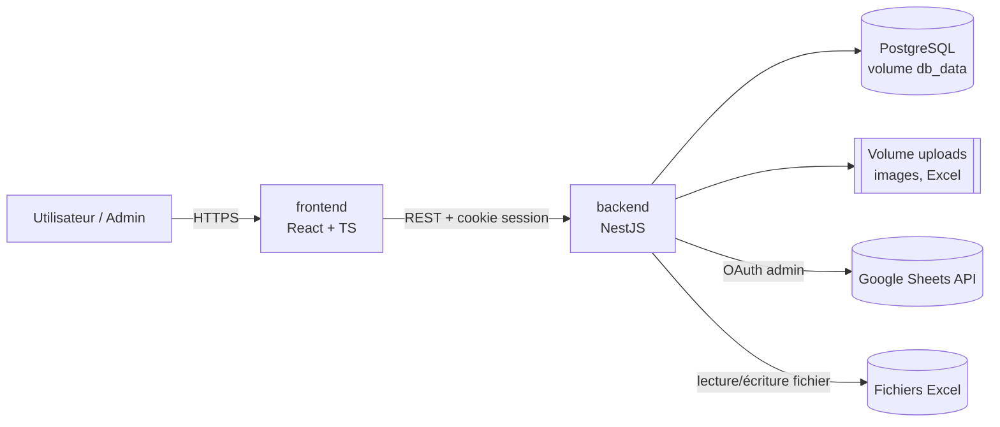
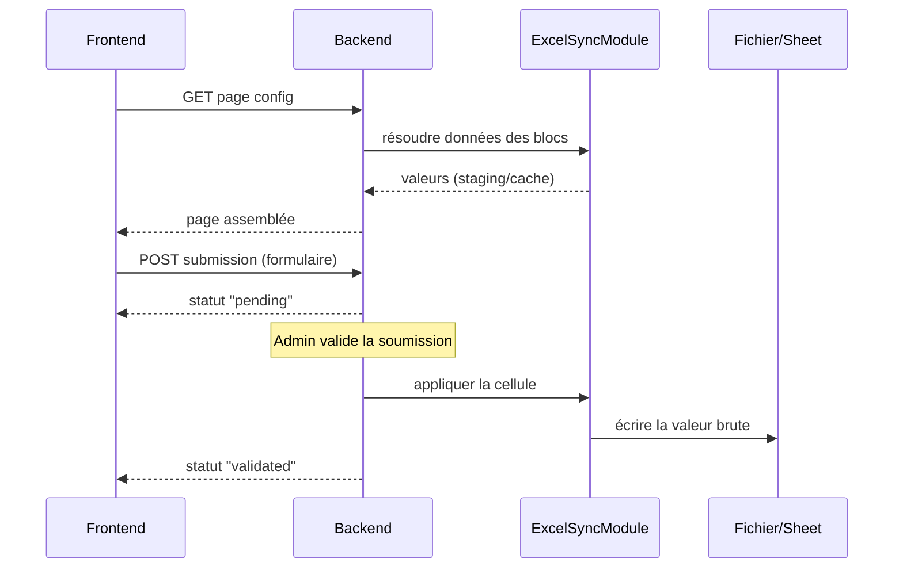

# Architecture

Ce document décrit le "comment" technique de Strategos. Pour le "quoi" (fonctionnalités, profils, droits, page builder), voir [README.md](README.md).

## 1. Vue d'ensemble

Trois conteneurs Docker Compose. Le backend est le seul point de contact avec les fichiers Excel et l'API Google Sheets — le frontend ne parle qu'au backend.

## 2. Découpage en modules NestJS

Un module par domaine, chacun avec ses guards et ses DTOs validés via `class-validator` :

- **AuthModule** : session (cookie signé, table `sessions` en Postgres), hash bcrypt/argon2, `AuthGuard`.
- **GroupsModule** : groupes, appartenance user↔groupe, calcul des permissions effectives (union des groupes).
- **PermissionsModule** : `PermissionsGuard` réutilisable sur chaque route, vérifie lecture/écriture/création par ressource (page, sujet, message) — voir [Droits d'accès](README.md#droits-daccès--modèle-par-groupes).
- **PagesModule** : CRUD des pages, config JSON des zones/blocs, soft-delete.
- **TopicsModule** : sujets et messages, pièces jointes images.
- **ExcelSyncModule** : cœur technique de la synchronisation Excel/Sheets — détaillé en §4.
- **TemplatesModule** : bibliothèque de modèles (formulaires, pages, sujets) et instanciation avec réinitialisation des mappings — voir [Modèles et duplication](README.md#modèles-et-duplication).
- **FilesModule** : upload, stockage sur le volume Docker, métadonnées en base.

## 3. Modèle de données (entités clés)

- `users`, `groups`, `user_groups`
- `group_permissions(group_id, resource_type, resource_id?, can_read, can_write, can_create)`
- `pages(id, name, zones_config JSONB, deleted_at)` — la config JSON est la liste ordonnée de blocs typés par zone (Header/Main/Sidebar/Footer)
- `topics(id, ...)`, `messages(id, topic_id, ...)`
- `excel_sources(id, type[excel|gsheet], connection_info, last_synced_at)`
- `excel_staging_cells(source_id, sheet_ref, cell_ref, value, formula?)` — staging des données importées/lues, jamais reparsées à chaque affichage
- `cell_references(source_id, sheet_ref, cell_or_range, referenced_source_id, referenced_ref)` — résolution des liaisons inter-fichiers (§4)
- `forms(id, page_block_id, fields JSONB)`
- `form_field_mappings(form_id, field_key, source_id, cell_ref)`
- `submissions(id, form_id, user_id, values JSONB, status[pending|validated|rejected|modified])`
- `templates(id, type[form|page|topic], payload JSONB)`

Soft-delete (`deleted_at`) sur pages, formulaires, sujets, messages, groupes, utilisateurs — voir [Suppression de contenu](README.md#suppression-de-contenu).

## 4. Moteur Excel/Sheets (`ExcelSyncModule`)

Réponse au point ouvert du README sur la résolution des liaisons inter-fichiers :

- Chaque source (fichier Excel importé ou Google Sheet connecté) reçoit un `source_id` stable, indépendant de tout chemin de fichier.
- À l'import/sync, les cellules contenant une formule de liaison externe sont détectées et résolues en référence `(source_id, sheet_ref, cell_or_range)`, stockée dans `cell_references` — jamais par chemin.
- À la lecture d'une page, le backend résout récursivement ces références via la table plutôt que de reparser les formules.
- Un **cache court (30-60s)** protège les lectures Google Sheets live des quotas API ; invalidation par `source_id`. Les fichiers Excel sont importés à un instant T et réimportés manuellement — voir [Excel et Google Sheets](README.md#excel-et-google-sheets).
- À la validation d'une soumission, le backend écrit la valeur brute sur la cellule cible (API Sheets ou réécriture du fichier Excel), sans se préoccuper des formules amont — cohérent avec l'écrasement de formule déjà spécifié.

## 5. Frontend (React + TS)

- Rendu piloté par la config JSON des pages : un `BlockRenderer` avec un registre `{ blockType: Component }` couvrant chaque module du [page builder](README.md#page-builder-modules-préformatés) (image, tableau, catalogue, chatbot, sujets, boutons, formulaire, carte cliquable).
- L'éditeur de **carte cliquable** (polygones libres, détection de chevauchement) est un composant isolé — le plus complexe du builder, sur canvas/SVG dédié.
- Layout responsive par zones (Header/Main/Sidebar/Footer) en CSS Grid/Flexbox, breakpoints mobile/tablette.
- Client HTTP simple (fetch/axios) avec session par cookie ; React Query pour le cache des lectures suffit vu l'échelle attendue (pas de state manager lourd).

## 6. Flux clés

## 7. Déploiement

Un seul `docker-compose.yml` : services `frontend`, `backend`, `db`, volumes nommés `db_data` et `uploads`. Variables d'environnement pour les credentials OAuth Google Sheets de l'administrateur unique. Une seule commande (`docker compose up`) pour tout lancer.

## 8. Sécurité

- Sessions : cookie `httpOnly`, `secure` en production, rotation à la connexion.
- `PermissionsGuard` appliqué à chaque route (lecture/écriture/création) — jamais de vérification uniquement côté frontend.
- Validation stricte des mappings champ→cellule pour empêcher toute écriture hors du périmètre défini par l'admin.
- Les cas "édition directe par l'administrateur" et "cellule-formule ciblée" restent des avertissements côté UI (déjà spécifiés au README), pas des contraintes techniques supplémentaires.
