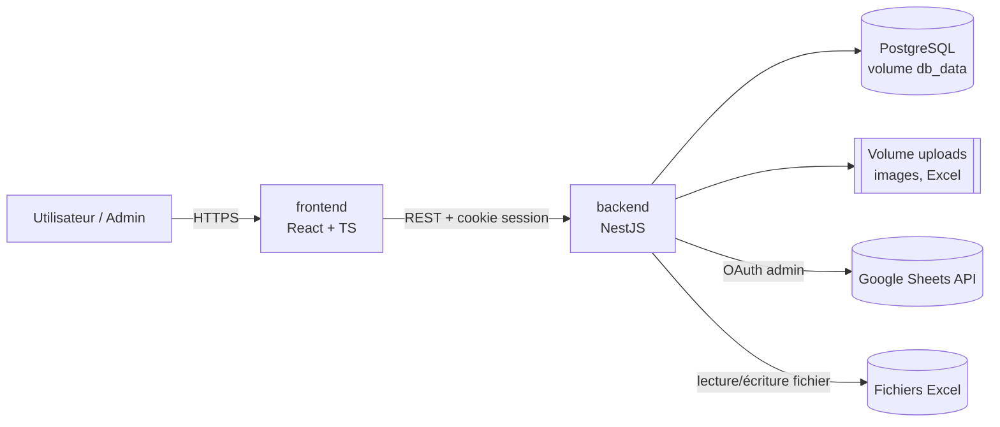
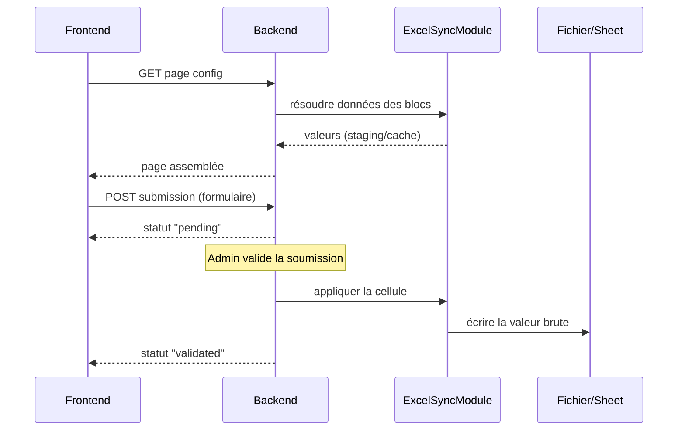

# Architecture

Ce document est le squelette technique de Strategos : il relie les parties de la conception entre elles. Le détail fonctionnel et les règles propres à chaque domaine sont dans [conception/](conception/).

## Sommaire de la conception

| # | Partie | Contenu |
|---|---|---|
| 01 | [Vision](conception/01-vision.md) | Objectif, principe fondateur, profils |
| 02 | [Comptes et authentification](conception/02-comptes-authentification.md) | Sessions, cycle de vie des comptes |
| 03 | [Droits et groupes](conception/03-droits-groupes.md) | Modèle par groupes, calcul des droits effectifs |
| 04 | [Administration](conception/04-administration.md) | Espace admin, visualisation des droits, journal |
| 05 | [Profil utilisateur](conception/05-profil-utilisateur.md) | Page administrative, notes personnelles |
| 06 | [Page builder](conception/06-page-builder.md) | Zones, personnalisation, modules |
| 07 | [Discussions](conception/07-discussions.md) | Sujets, messages, chat temps réel |
| 08 | [Sources de données](conception/08-sources-donnees.md) | Excel, Google Sheets, cache, liaisons |
| 09 | [Formulaires et soumissions](conception/09-formulaires-soumissions.md) | Modification, ajout, validation |
| 10 | [Modèles et duplication](conception/10-modeles-duplication.md) | Bibliothèque de modèles |
| 11 | [Transverse](conception/11-transverse.md) | Stack, notifications, suppression, stockage |

## 1. Vue d'ensemble

Trois conteneurs Docker Compose. Le backend est le seul point de contact avec les fichiers Excel et l'API Google Sheets — le frontend ne parle qu'au backend.

## 2. Découpage en modules NestJS

Un module par domaine, chacun avec ses guards et ses DTOs validés via `class-validator` :

- **AuthModule** : session, hash, `AuthGuard` — voir [02](conception/02-comptes-authentification.md).
- **UsersModule** : CRUD des comptes, réinitialisation du mot de passe, désactivation/réactivation — voir [02](conception/02-comptes-authentification.md).
- **GroupsModule** : groupes, appartenance user↔groupe, calcul des permissions effectives et endpoints de lecture des droits — voir [03](conception/03-droits-groupes.md).
- **PermissionsModule** : `PermissionsGuard` réutilisable sur chaque route — voir [03](conception/03-droits-groupes.md).
- **AuditModule** : journal des modifications ; appelé par UsersModule, GroupsModule, ProfileModule, PagesModule, ExcelSyncModule et TemplatesModule — voir [04](conception/04-administration.md).
- **ProfileModule** : page administrative du profil et notes personnelles — voir [05](conception/05-profil-utilisateur.md).
- **PagesModule** : CRUD des pages, config JSON des zones/blocs, soft-delete — voir [06](conception/06-page-builder.md).
- **TopicsModule** : sujets et messages, pièces jointes images — voir [07](conception/07-discussions.md).
- **ExcelSyncModule** : cœur technique de la synchronisation Excel/Sheets — voir [08](conception/08-sources-donnees.md) et [09](conception/09-formulaires-soumissions.md).
- **TemplatesModule** : bibliothèque de modèles et instanciation — voir [10](conception/10-modeles-duplication.md).
- **FilesModule** : upload, stockage sur le volume Docker, métadonnées en base — voir [11](conception/11-transverse.md).

## 3. Modèle de données (entités clés)

- `users(id, username, password_hash, must_change_credentials, disabled_at, deleted_at)`, `groups(id, name, description, deleted_at)`, `user_groups` — `must_change_credentials` force le changement d'identifiants ([02](conception/02-comptes-authentification.md#compte-administrateur))
- `group_permissions(group_id, resource_type, resource_id, can_read, can_write, can_create)` — `resource_id` obligatoire (pas de permission « sur tout ») ; contraintes par type de ressource : page = `can_read` seul, message = `can_read` + `can_create` ([03](conception/03-droits-groupes.md#points-techniques))
- `settings(landing_page_id, …)` — réglages globaux de l'instance, dont la page d'arrivée unique ([03](conception/03-droits-groupes.md#visibilité-et-page-darrivée))
- `themes(id, name, config JSONB, is_default)` — thèmes nommés ([06](conception/06-page-builder.md#options-de-personnalisation-des-zones))
- `pages(id, name, theme_id?, zones_config JSONB, deleted_at)` — la config JSON est la liste ordonnée de blocs typés par zone (Header/Main/Sidebar/Footer) ; les blocs tableau et catalogue portent `range_mode[fixed|extensible]` ; `theme_id` vide = thème par défaut
- `topics(id, ...)`, `messages(id, topic_id, author_id, ...)`
- `message_revisions(message_id, content, edited_at, action[edit|delete])` — archive des modifications et suppressions par l'auteur ([07](conception/07-discussions.md#points-techniques))
- `excel_sources(id, type[excel|gsheet], connection_info, last_synced_at)`
- `excel_staging_cells(source_id, sheet_ref, cell_ref, value, formula?)` — staging des données importées/lues, jamais reparsées à chaque affichage
- `cell_references(source_id, sheet_ref, cell_or_range, referenced_source_id, referenced_ref)` — résolution des liaisons inter-fichiers ([08](conception/08-sources-donnees.md))
- `forms(id, page_block_id, fields JSONB, mode[modification|ajout])`
- `form_add_config(form_id, source_id, sheet_ref, start_row, max_new_rows)` — portée définie par l'admin pour un formulaire en mode `ajout` (n'existe que pour ce mode)
- `form_field_mappings(form_id, field_key, source_id, cell_ref)` — pour un formulaire `ajout`, `cell_ref` contient une référence de colonne (ex. `"C"`) plutôt qu'une cellule complète : la ligne est résolue dynamiquement à la validation
- `submissions(id, form_id, user_id, values JSONB, status[pending|validated|rejected|modified], assigned_row?)` — `assigned_row` n'est rempli qu'à la validation d'une soumission de type `ajout`
- `templates(id, type[form|page|topic], payload JSONB)`
- `user_notes(id, user_id, title, content, created_at, updated_at, deleted_at)` — `content` en format riche restreint, nettoyé côté backend
- `audit_log(id, actor_id, action, target_type, target_id, before JSONB, after JSONB, created_at)` — journal en ajout seul (comptes, appartenances, permissions, soumissions, sources, pages, formulaires, restaurations, consultations de notes — liste complète dans [04](conception/04-administration.md#journal-des-modifications))

Le calcul des droits effectifs (fonction de résolution unique) est décrit dans [03 — Calcul des droits effectifs](conception/03-droits-groupes.md#calcul-des-droits-effectifs).

Soft-delete (`deleted_at`) sur pages, formulaires, sujets, messages, groupes, utilisateurs — voir [11 — Suppression de contenu](conception/11-transverse.md#suppression-de-contenu).

## 4. Moteur Excel/Sheets (`ExcelSyncModule`)

- Lecture, cache, liaisons inter-fichiers et écriture : voir [08 — Sources de données](conception/08-sources-donnees.md#points-techniques).
- Validation des soumissions `ajout` (calcul de la ligne, limite de lignes) : voir [09 — Formulaires et soumissions](conception/09-formulaires-soumissions.md#validation-dune-soumission-ajout).

## 5. Frontend (React + TS)

- Rendu piloté par la config JSON des pages via un `BlockRenderer` et un registre de modules — détail dans [06 — Page builder](conception/06-page-builder.md#points-techniques).
- Layout responsive par zones (Header/Main/Sidebar/Footer), breakpoints mobile/tablette.
- Client HTTP simple (fetch/axios) avec session par cookie ; React Query pour le cache des lectures suffit vu l'échelle attendue (pas de state manager lourd).

## 6. Flux clés

## 7. Déploiement

Un seul `docker-compose.yml` : services `frontend`, `backend`, `db`, volumes nommés `db_data` et `uploads`. Variables d'environnement pour les credentials OAuth Google Sheets de l'administrateur unique. Une seule commande (`docker compose up`) pour tout lancer.

## 8. Sécurité transverse

- `PermissionsGuard` appliqué à chaque route (lecture/écriture/création) — jamais de vérification uniquement côté frontend.
- Règles propres à chaque domaine :
  - sessions et révocation : [02](conception/02-comptes-authentification.md#points-techniques) ;
  - guard admin et intégrité du journal : [04](conception/04-administration.md#points-techniques) ;
  - accès au profil, notes et XSS : [05](conception/05-profil-utilisateur.md#points-techniques) ;
  - validation des mappings et périmètre d'écriture : [09](conception/09-formulaires-soumissions.md#sécurité).
