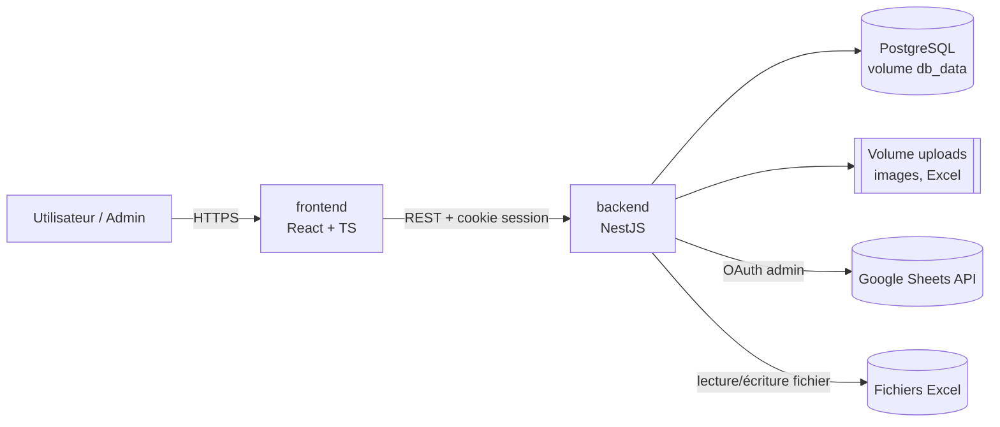
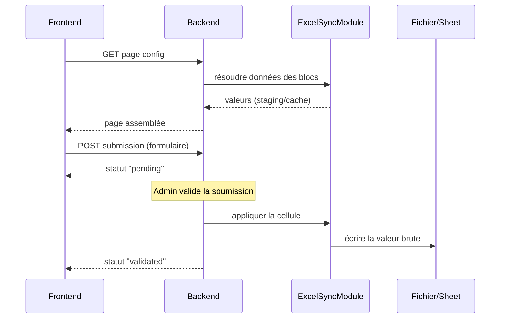

# Architecture

Ce document décrit le "comment" technique de Strategos. Pour le "quoi" (fonctionnalités, profils, droits, page builder), voir [README.md](README.md).

## 1. Vue d'ensemble

Trois conteneurs Docker Compose. Le backend est le seul point de contact avec les fichiers Excel et l'API Google Sheets — le frontend ne parle qu'au backend.

## 2. Découpage en modules NestJS

Un module par domaine, chacun avec ses guards et ses DTOs validés via `class-validator` :

- **AuthModule** : session (cookie signé, table `sessions` en Postgres), hash bcrypt/argon2, `AuthGuard`.
- **UsersModule** : CRUD des comptes, réinitialisation du mot de passe par l'admin, désactivation/réactivation (révocation des sessions via la table `sessions` d'AuthModule) — voir [Gestion des comptes et des groupes](README.md#gestion-des-comptes-et-des-groupes).
- **GroupsModule** : groupes, appartenance user↔groupe, calcul des permissions effectives (union des groupes) et endpoints de lecture des droits pour l'admin (par utilisateur, par groupe, par ressource, matrice globale).
- **ProfileModule** : page administrative du profil (agrège UsersModule et la fonction de résolution des droits de GroupsModule, réutilisée telle quelle) et CRUD des notes personnelles — voir [Profil utilisateur](README.md#profil-utilisateur).
- **AuditModule** : écriture et consultation du journal des modifications sur comptes, appartenances et permissions ; appelé par UsersModule, GroupsModule et PermissionsModule.
- **PermissionsModule** : `PermissionsGuard` réutilisable sur chaque route, vérifie lecture/écriture/création par ressource (page, sujet, message) — voir [Droits d'accès](README.md#droits-daccès--modèle-par-groupes).
- **PagesModule** : CRUD des pages, config JSON des zones/blocs, soft-delete.
- **TopicsModule** : sujets et messages, pièces jointes images.
- **ExcelSyncModule** : cœur technique de la synchronisation Excel/Sheets — détaillé en §4.
- **TemplatesModule** : bibliothèque de modèles (formulaires, pages, sujets) et instanciation avec réinitialisation des mappings — voir [Modèles et duplication](README.md#modèles-et-duplication).
- **FilesModule** : upload, stockage sur le volume Docker, métadonnées en base.

## 3. Modèle de données (entités clés)

- `users(id, username, password_hash, disabled_at, deleted_at)`, `groups(id, name, description, deleted_at)`, `user_groups`
- `group_permissions(group_id, resource_type, resource_id?, can_read, can_write, can_create)`
- `pages(id, name, zones_config JSONB, deleted_at)` — la config JSON est la liste ordonnée de blocs typés par zone (Header/Main/Sidebar/Footer)
- `topics(id, ...)`, `messages(id, topic_id, ...)`
- `excel_sources(id, type[excel|gsheet], connection_info, last_synced_at)`
- `excel_staging_cells(source_id, sheet_ref, cell_ref, value, formula?)` — staging des données importées/lues, jamais reparsées à chaque affichage
- `cell_references(source_id, sheet_ref, cell_or_range, referenced_source_id, referenced_ref)` — résolution des liaisons inter-fichiers (§4)
- `forms(id, page_block_id, fields JSONB, mode[modification|ajout])`
- `form_add_config(form_id, source_id, sheet_ref, start_row, max_new_rows)` — portée définie par l'admin pour un formulaire en mode `ajout` (n'existe que pour ce mode)
- `form_field_mappings(form_id, field_key, source_id, cell_ref)` — pour un formulaire `ajout`, `cell_ref` contient une référence de colonne (ex. `"C"`) plutôt qu'une cellule complète : la ligne est résolue dynamiquement à la validation
- `submissions(id, form_id, user_id, values JSONB, status[pending|validated|rejected|modified], assigned_row?)` — `assigned_row` n'est rempli qu'à la validation d'une soumission de type `ajout`
- `templates(id, type[form|page|topic], payload JSONB)`
- `user_notes(id, user_id, title, content, created_at, updated_at, deleted_at)` — `content` en format riche restreint, nettoyé côté backend
- `audit_log(id, actor_id, action, target_type, target_id, before JSONB, after JSONB, created_at)` — journal en ajout seul des changements de comptes, appartenances et permissions

### Calcul des droits effectifs
Une **seule fonction de résolution** dans GroupsModule calcule les droits effectifs d'un utilisateur sur une ressource, en retournant pour chaque droit (lecture/écriture/création) la liste des groupes qui l'accordent. Elle est utilisée **à la fois** par `PermissionsGuard` et par les vues d'administration : ce que l'admin voit est exactement ce qui est appliqué. La matrice globale est calculée côté backend, avec pagination et filtres (échelle : quelques centaines d'utilisateurs).

Soft-delete (`deleted_at`) sur pages, formulaires, sujets, messages, groupes, utilisateurs — voir [Suppression de contenu](README.md#suppression-de-contenu).

## 4. Moteur Excel/Sheets (`ExcelSyncModule`)

Réponse au point ouvert du README sur la résolution des liaisons inter-fichiers :

- Chaque source (fichier Excel importé ou Google Sheet connecté) reçoit un `source_id` stable, indépendant de tout chemin de fichier.
- À l'import/sync, les cellules contenant une formule de liaison externe sont détectées et résolues en référence `(source_id, sheet_ref, cell_or_range)`, stockée dans `cell_references` — jamais par chemin.
- À la lecture d'une page, le backend résout récursivement ces références via la table plutôt que de reparser les formules.
- Un **cache court (30-60s)** protège les lectures Google Sheets live des quotas API ; invalidation par `source_id`. Les fichiers Excel sont importés à un instant T et réimportés manuellement — voir [Excel et Google Sheets](README.md#excel-et-google-sheets).
- À la validation d'une soumission, le backend écrit la valeur brute sur la cellule cible (API Sheets ou réécriture du fichier Excel), sans se préoccuper des formules amont — cohérent avec l'écrasement de formule déjà spécifié.
- **Validation d'une soumission `ajout`** : la ligne cible n'est calculée qu'à ce moment-là, jamais à la soumission.
  - Prochaine ligne libre = `start_row` + nombre de soumissions déjà `validated` sur ce formulaire (ordonnées par date de validation, pas de soumission).
  - Vérification de `max_new_rows` avant écriture ; si la limite est atteinte, la validation est bloquée avec une erreur explicite côté admin (la soumission reste `pending`, refusable mais pas validable).
  - Écriture : chaque valeur de champ est écrite sur `(assigned_row, colonne mappée)`, en réutilisant le même mécanisme d'écriture que pour les formulaires de modification ; `assigned_row` est ensuite stocké sur la soumission.

## 5. Frontend (React + TS)

- Rendu piloté par la config JSON des pages : un `BlockRenderer` avec un registre `{ blockType: Component }` couvrant chaque module du [page builder](README.md#page-builder-modules-préformatés) (image, tableau, catalogue, chatbot, sujets, boutons, formulaire, carte cliquable).
- L'éditeur de **carte cliquable** (polygones libres, détection de chevauchement) est un composant isolé — le plus complexe du builder, sur canvas/SVG dédié.
- Layout responsive par zones (Header/Main/Sidebar/Footer) en CSS Grid/Flexbox, breakpoints mobile/tablette.
- Client HTTP simple (fetch/axios) avec session par cookie ; React Query pour le cache des lectures suffit vu l'échelle attendue (pas de state manager lourd).

## 6. Flux clés

## 7. Déploiement

Un seul `docker-compose.yml` : services `frontend`, `backend`, `db`, volumes nommés `db_data` et `uploads`. Variables d'environnement pour les credentials OAuth Google Sheets de l'administrateur unique. Une seule commande (`docker compose up`) pour tout lancer.

## 8. Sécurité

- Sessions : cookie `httpOnly`, `secure` en production, rotation à la connexion.
- `PermissionsGuard` appliqué à chaque route (lecture/écriture/création) — jamais de vérification uniquement côté frontend.
- Routes d'administration (comptes, groupes, droits, journal) protégées par un guard de rôle admin.
- Désactivation ou suppression d'un compte → révocation immédiate de toutes ses sessions.
- Chaque entrée du journal d'audit est écrite dans la **même transaction** que la modification qu'elle trace ; aucune route de modification ou de suppression du journal n'est exposée.
- Profil et notes : accès vérifié par propriété (`user_id` = utilisateur de la session) ou rôle admin, jamais via `PermissionsGuard` ni les groupes. Côté admin, routes de notes en lecture seule (GET uniquement) ; chaque lecture écrit une entrée `audit_log` (action `notes.read`).
- Contenu des notes nettoyé côté backend (liste blanche de balises) contre le XSS.
- Validation stricte des mappings champ→cellule pour empêcher toute écriture hors du périmètre défini par l'admin. Pour un formulaire `ajout`, cette validation couvre aussi : les colonnes doivent appartenir à la plage autorisée par l'admin, la ligne assignée doit être ≥ `start_row`, et le nombre de lignes créées ne doit jamais dépasser `max_new_rows` — vérifié côté backend à la validation, jamais seulement côté frontend.
- Les cas "édition directe par l'administrateur" et "cellule-formule ciblée" restent des avertissements côté UI (déjà spécifiés au README), pas des contraintes techniques supplémentaires.
