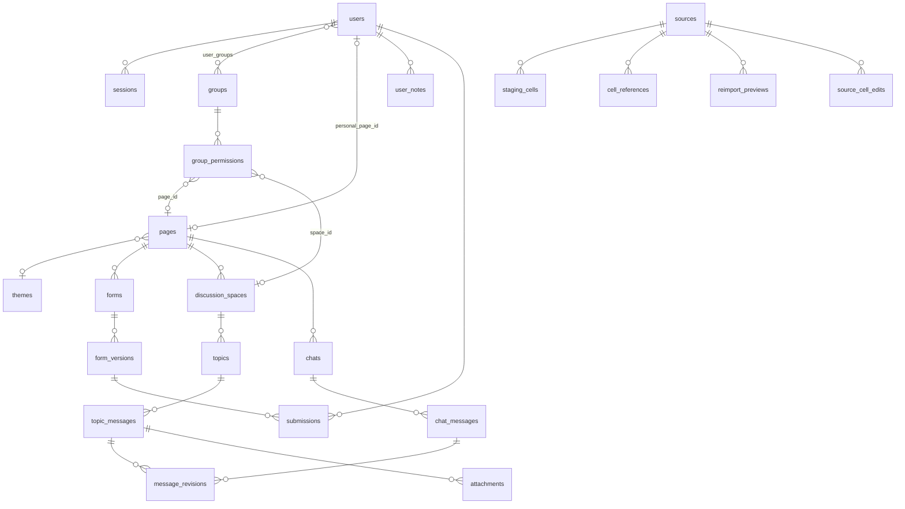

# 14 — Modèle de données

## Objet
Le schéma complet de la base PostgreSQL : tables, colonnes, clés, index et contraintes, domaine par domaine. Il est la **référence** pour les tables : les autres parties n'en donnent que des extraits. Il sera traduit en schéma **Prisma** ; ce que Prisma ne sait pas exprimer (contraintes `CHECK`, index partiels, trigger) est ajouté en SQL dans les migrations.

## 1. Conventions

| Sujet | Règle |
|---|---|
| Nommage | Tables et colonnes en `snake_case`, au pluriel pour les tables (`@@map` / `@map` côté Prisma) |
| Identifiants | `uuid`, en **UUID v7** générés par l'application : ils sont ordonnés dans le temps, ce qui permet la pagination par curseur (chat) et de bons index |
| Dates | `timestamptz`, en UTC |
| Horodatage | `created_at` (défaut `now()`) sur les tables de contenu, pas sur les tables techniques (`settings`, `layout_parts`, `onedrive_credentials`, `staging_cells`, `cell_references`, `form_versions`, qui ont leur propre date) ; `updated_at` sur les tables modifiables |
| Verrouillage optimiste | `version int not null default 1` sur les objets édités par l'admin, incrémentée à chaque mise à jour (`409 EDIT_CONFLICT`, voir [API](13-api.md#modifications-concurrentes-admin)) |
| Suppression douce | `deleted_at timestamptz null`. Les lectures courantes filtrent `deleted_at is null` |
| Unicité et suppression douce | Les unicités « métier » (pseudo, nom de groupe, nom de fichier…) sont des **index uniques partiels** `where deleted_at is null` : un nom libéré par une suppression peut être réutilisé. Restaurer un élément dont le nom a été repris échoue avec `409` |
| Clés étrangères | `on delete restrict` par défaut, puisqu'on ne supprime presque jamais physiquement. Les exceptions sont indiquées |
| Énumérations | Types `enum` PostgreSQL, déclarés dans Prisma |
| JSON | `jsonb`, validé côté application (`class-validator`) avant écriture |
| Polymorphisme | Évité : quand une ligne peut viser deux types d'objets, elle porte **deux colonnes de clé étrangère** nullables et une contrainte `CHECK` « exactement une renseignée », pour garder l'intégrité référentielle |

Légende des tableaux : **N** = nullable ; « — » = pas de défaut.

## 2. Comptes et sessions
Voir [02](02-comptes-authentification.md).

### `users`
| Colonne | Type | N | Défaut | Contrainte / rôle |
|---|---|---|---|---|
| `id` | uuid | | — | PK |
| `username` | citext | | — | Pseudo, insensible à la casse ; unique parmi les non supprimés |
| `password_hash` | text | | — | Argon2id |
| `is_admin` | boolean | | `false` | Un seul admin : index unique partiel `(is_admin) where is_admin` |
| `must_change_credentials` | boolean | | `true` | Mot de passe temporaire à la création et à la réinitialisation |
| `personal_page_id` | uuid | N | — | FK `pages`, `on delete set null` |
| `disabled_at` | timestamptz | N | — | Compte désactivé |
| `created_at`, `updated_at` | timestamptz | | `now()` | |
| `deleted_at` | timestamptz | N | — | Suppression douce |
| `version` | int | | `1` | |

Index : unique partiel `(username) where deleted_at is null` ; unique partiel `(is_admin) where is_admin`.

### `sessions`
| Colonne | Type | N | Défaut | Contrainte / rôle |
|---|---|---|---|---|
| `id` | text | | — | PK : **empreinte** (SHA-256) du jeton de session ; le jeton en clair n'est jamais stocké |
| `user_id` | uuid | | — | FK `users`, `on delete cascade` |
| `csrf_secret` | text | | — | Sert à dériver le jeton CSRF |
| `created_at`, `last_seen_at` | timestamptz | | `now()` | |
| `expires_at` | timestamptz | | — | |
| `ip`, `user_agent` | text | N | — | Information |

Index : `(user_id)` (révocation de toutes les sessions d'un compte), `(expires_at)` (purge).

### `login_attempts`
Limitation des tentatives de connexion. Elle est stockée en base, pour survivre à un redémarrage.

| Colonne | Type | N | Défaut | Contrainte / rôle |
|---|---|---|---|---|
| `id` | uuid | | — | PK |
| `username` | citext | | — | Pseudo tenté (même inexistant) |
| `ip` | inet | | — | |
| `success` | boolean | | — | |
| `created_at` | timestamptz | | `now()` | |

Index : `(username, created_at)`, `(ip, created_at)`. Les lignes de plus de 24 h sont purgées chaque jour.

## 3. Groupes et droits
Voir [03](03-droits-groupes.md).

### `groups`
| Colonne | Type | N | Défaut | Contrainte / rôle |
|---|---|---|---|---|
| `id` | uuid | | — | PK |
| `name` | citext | | — | Unique parmi les non supprimés |
| `description` | text | N | — | |
| `created_at`, `updated_at` | timestamptz | | `now()` | |
| `deleted_at` | timestamptz | N | — | |
| `version` | int | | `1` | |

### `user_groups`
| Colonne | Type | N | Défaut | Contrainte / rôle |
|---|---|---|---|---|
| `user_id` | uuid | | — | FK `users` ; PK composite |
| `group_id` | uuid | | — | FK `groups` ; PK composite |
| `created_at` | timestamptz | | `now()` | |

Index : `(group_id)` (membres d'un groupe). Les appartenances d'un utilisateur ou d'un groupe supprimés sont conservées (historique) mais ignorées par le calcul des droits.

### `group_permissions`
| Colonne | Type | N | Défaut | Contrainte / rôle |
|---|---|---|---|---|
| `id` | uuid | | — | PK |
| `group_id` | uuid | | — | FK `groups` |
| `page_id` | uuid | N | — | FK `pages` |
| `space_id` | uuid | N | — | FK `discussion_spaces` |
| `can_read` | boolean | | `false` | |
| `can_create_topic` | boolean | | `false` | |
| `can_post` | boolean | | `false` | |
| `created_at`, `updated_at` | timestamptz | | `now()` | |

Contraintes `CHECK` :
- exactement une cible : `num_nonnulls(page_id, space_id) = 1` ;
- une page n'accorde que la lecture : `page_id is null or (not can_create_topic and not can_post)` ;
- on ne crée pas sans lire : `(not can_create_topic and not can_post) or can_read`.

Index uniques : `(group_id, page_id)` et `(group_id, space_id)`. Index `(page_id)` et `(space_id)` pour les vues « par ressource ».

## 4. Instance, thèmes, médias, sauvegardes
Voir [04](04-administration.md), [06](06-page-builder.md), [11](11-transverse.md).

### `settings`
Table à **une seule ligne**.

| Colonne | Type | N | Défaut | Contrainte / rôle |
|---|---|---|---|---|
| `id` | smallint | | `1` | PK, `check (id = 1)` |
| `landing_page_id` | uuid | N | — | FK `pages`, `on delete set null` |
| `default_theme_id` | uuid | N | — | FK `themes` ; seul endroit qui désigne le thème par défaut |
| `backup_retention_days` | int | | `7` | `check (> 0)` |
| `updated_at` | timestamptz | | `now()` | |
| `version` | int | | `1` | |

### `themes`
| Colonne | Type | N | Défaut | Contrainte / rôle |
|---|---|---|---|---|
| `id` | uuid | | — | PK |
| `name` | citext | | — | Unique |
| `config` | jsonb | | — | Fond (couleur, image de la médiathèque), textes (couleurs, polices, taille), encadrés, boutons (plein ou contour), tableaux, cartes et discussions. Polices : liste fermée de piles de polices système (`THEME_FONTS`), sans chargement externe |
| `created_at`, `updated_at` | timestamptz | | `now()` | |
| `version` | int | | `1` | |

Les thèmes ne passent pas par la corbeille : leur suppression est **physique**, et refusée pour le thème par défaut. Les pages qui l'utilisaient reviennent au thème par défaut (`pages.theme_id` → `on delete set null`).

### `media` — médiathèque
| Colonne | Type | N | Défaut | Contrainte / rôle |
|---|---|---|---|---|
| `id` | uuid | | — | PK |
| `filename` | text | | — | Nom référencé dans les catalogues (« epee.png ») ; unique parmi les non supprimés |
| `storage_path` | text | | — | Chemin dans le volume `uploads` |
| `mime` | text | | — | |
| `size_bytes` | bigint | | — | |
| `alt` | text | N | — | Texte alternatif par défaut |
| `uploaded_by` | uuid | | — | FK `users` |
| `created_at` | timestamptz | | `now()` | |
| `deleted_at` | timestamptz | N | — | |

### `backups`
| Colonne | Type | N | Défaut | Contrainte / rôle |
|---|---|---|---|---|
| `id` | uuid | | — | PK |
| `status` | enum `backup_status` (`running`, `ok`, `failed`) | | `running` | |
| `file_path` | text | N | — | Archive dans le volume `backups` |
| `size_bytes` | bigint | N | — | |
| `error` | text | N | — | |
| `created_at` | timestamptz | | `now()` | |
| `finished_at` | timestamptz | N | — | |

## 5. Pages
Voir [06](06-page-builder.md).

### `pages`
| Colonne | Type | N | Défaut | Contrainte / rôle |
|---|---|---|---|---|
| `id` | uuid | | — | PK |
| `name` | text | | — | Nom interne (sélecteurs de liens, admin) |
| `theme_id` | uuid | N | — | FK `themes`, `on delete set null` ; vide = thème par défaut. Reflète la version **publiée** (le brouillon porte son propre `themeId` dans `draft_config`) |
| `show_header`, `show_footer` | boolean | | `true` | Reflètent la version publiée, comme `theme_id` |
| `draft_config` | jsonb | | `'{}'` | Zones → rangées → colonnes → blocs (brouillon) |
| `published_config` | jsonb | N | — | Dernière version publiée ; vide = jamais publiée |
| `published_at` | timestamptz | N | — | |
| `published_by` | uuid | N | — | FK `users` |
| `created_at`, `updated_at` | timestamptz | | `now()` | |
| `deleted_at` | timestamptz | N | — | |
| `version` | int | | `1` | |

Les blocs vivent dans le JSON et portent un `id` (uuid) stable. Les modules qui ont leurs propres données (formulaires, espaces, chats) ont une ligne dans leur table, avec `page_id` et `block_id`.

### `layout_parts` — header et footer partagés
La config n'accepte que des blocs sans données propres (image, boutons, contenu libre, tableau, catalogue).

| Colonne | Type | N | Défaut | Contrainte / rôle |
|---|---|---|---|---|
| `kind` | enum `layout_kind` (`header`, `footer`) | | — | PK |
| `draft_config` | jsonb | | `'{}'` | |
| `published_config` | jsonb | N | — | |
| `published_at` | timestamptz | N | — | |
| `updated_at` | timestamptz | | `now()` | |
| `version` | int | | `1` | |

## 6. Discussions
Voir [07](07-discussions.md).

### `discussion_spaces`
| Colonne | Type | N | Défaut | Contrainte / rôle |
|---|---|---|---|---|
| `id` | uuid | | — | PK |
| `page_id` | uuid | | — | FK `pages` |
| `block_id` | uuid | | — | Unique ; id du bloc dans la page |
| `name` | text | | — | |
| `sort_mode` | enum `topic_sort` (`activity`, `created`) | | `activity` | |
| `created_at`, `updated_at` | timestamptz | | `now()` | Ligne créée à la **publication** de la page |
| `deleted_at` | timestamptz | N | — | Bloc retiré à une publication, ou page supprimée |

### `topics`
| Colonne | Type | N | Défaut | Contrainte / rôle |
|---|---|---|---|---|
| `id` | uuid | | — | PK |
| `space_id` | uuid | | — | FK `discussion_spaces` |
| `author_id` | uuid | | — | FK `users` |
| `title` | text | | — | |
| `closed_at` | timestamptz | N | — | Sujet clos |
| `pinned_at` | timestamptz | N | — | Épinglé par l'admin |
| `last_activity_at` | timestamptz | | `now()` | Mis à jour à chaque message (tri « activité ») |
| `created_at`, `updated_at` | timestamptz | | `now()` | |
| `deleted_at` | timestamptz | N | — | |

Index : `(space_id, pinned_at desc nulls last, last_activity_at desc) where deleted_at is null`.

### `topic_messages`
| Colonne | Type | N | Défaut | Contrainte / rôle |
|---|---|---|---|---|
| `id` | uuid | | — | PK (v7 : ordre chronologique) |
| `topic_id` | uuid | | — | FK `topics` |
| `author_id` | uuid | | — | FK `users` |
| `content` | text | | — | Texte nettoyé (liste blanche) |
| `created_at` | timestamptz | | `now()` | |
| `edited_at` | timestamptz | N | — | |
| `hidden_at` | timestamptz | N | — | Masqué par l'admin |
| `hidden_by` | uuid | N | — | FK `users`, `on delete set null` |
| `deleted_at` | timestamptz | N | — | Supprimé par l'auteur (ou l'admin) |

Index : `(topic_id, id)`.

### `chats` et `chat_messages`
`chats` : `id` PK, `page_id` FK, `block_id` unique, `name`, `created_at`, `updated_at`, `deleted_at`, avec le même cycle de vie que les espaces.

`chat_messages` : mêmes colonnes que `topic_messages`, avec `chat_id` (FK `chats`) à la place de `topic_id`. Index `(chat_id, id)` pour l'historique par curseur (`before` / `after`).

### `message_revisions`
Archive des versions précédentes et des masquages.

| Colonne | Type | N | Défaut | Contrainte / rôle |
|---|---|---|---|---|
| `id` | uuid | | — | PK |
| `topic_message_id` | uuid | N | — | FK `topic_messages`, `on delete cascade` |
| `chat_message_id` | uuid | N | — | FK `chat_messages`, `on delete cascade` (colonne créée sans FK à l'étape 8 ; la FK et `chat_messages` arrivent à l'étape 9) |
| `action` | enum `revision_action` (`edit`, `delete`, `hide`, `unhide`) | | — | |
| `previous_content` | text | | — | Contenu **avant** l'action |
| `actor_id` | uuid | | — | FK `users` (l'auteur ou l'admin) |
| `created_at` | timestamptz | | `now()` | |

`check (num_nonnulls(topic_message_id, chat_message_id) = 1)`. Index sur chacune des deux FK.

### `attachments`
| Colonne | Type | N | Défaut | Contrainte / rôle |
|---|---|---|---|---|
| `id` | uuid | | — | PK |
| `uploader_id` | uuid | | — | FK `users` |
| `topic_message_id` | uuid | N | — | FK `topic_messages`, `on delete cascade` |
| `chat_message_id` | uuid | N | — | FK `chat_messages`, `on delete cascade` (colonne créée sans FK à l'étape 8 ; la FK et `chat_messages` arrivent à l'étape 9) |
| `storage_path`, `mime` | text | | — | JPEG, PNG, WebP ou GIF |
| `size_bytes` | int | | — | `check (size_bytes <= 5242880)` |
| `created_at` | timestamptz | | `now()` | |

`check (num_nonnulls(topic_message_id, chat_message_id) <= 1)` : une pièce jointe vient d'être uploadée (aucun rattachement) ou est rattachée à un seul message. Index sur `topic_message_id` et sur `chat_message_id`. Les pièces jointes jamais rattachées sont purgées au bout de 24 h. La limite de 4 par message est vérifiée par l'application.

## 7. Sources de données
Voir [08](08-sources-donnees.md).

### `sources`
| Colonne | Type | N | Défaut | Contrainte / rôle |
|---|---|---|---|---|
| `id` | uuid | | — | PK (`source_id` stable) |
| `type` | enum `source_type` (`upload`, `gsheet`, `onedrive`) | | — | |
| `name` | text | | — | Nom affiché (nom du fichier ou du Sheet) |
| `connection_info` | jsonb | | — | `gsheet` : `spreadsheetId` ; `onedrive` : `driveId`, `itemId` ; `upload` : `storagePath` et `sheets` (feuilles, dans l'ordre du classeur) |
| `status` | enum `source_status` (`ok`, `unavailable`, `auth_expired`) | | `ok` | Dernier état connu |
| `last_read_at` | timestamptz | N | — | Dernière lecture réussie (sources connectées) |
| `last_imported_at` | timestamptz | N | — | Dernier import ou réimport (upload) |
| `last_downloaded_at` | timestamptz | N | — | Dernier téléchargement (upload) : sert à l'avertissement de réimport |
| `created_by` | uuid | | — | FK `users` |
| `created_at`, `updated_at` | timestamptz | | `now()` | |
| `deleted_at` | timestamptz | N | — | |
| `version` | int | | `1` | |

### `staging_cells` — Excel uploadés uniquement
| Colonne | Type | N | Défaut | Contrainte / rôle |
|---|---|---|---|---|
| `source_id` | uuid | | — | FK `sources`, `on delete cascade` ; PK composite |
| `sheet` | text | | — | Nom de la feuille ; PK composite |
| `row` | int | | — | Numéro de ligne (1…) ; PK composite |
| `col` | int | | — | Numéro de colonne (1 = A) ; PK composite |
| `value_type` | enum `cell_type` (`empty`, `text`, `number`, `bool`, `date`, `error`) | | — | |
| `value_text` | text | N | — | Valeur affichable |
| `value_number` | numeric | N | — | Pour les tris, filtres et mouvements |
| `formula` | text | N | — | Formule d'origine, si la cellule en contient une |
| `needs_recalc` | boolean | | `false` | Dépend d'une valeur écrite depuis l'import |

La PK `(source_id, sheet, row, col)` sert aussi d'index pour lire une plage (lignes contiguës). Les numéros de ligne et de colonne sont stockés en entiers (et non en `"C5"`) pour les plages, la recherche de la dernière ligne remplie et la première ligne vide. Un réimport remplace toutes les lignes de la source dans une transaction.

### `cell_references` — liaisons inter-fichiers
| Colonne | Type | N | Défaut | Contrainte / rôle |
|---|---|---|---|---|
| `id` | uuid | | — | PK |
| `source_id`, `sheet`, `row`, `col` | … | | — | Cellule qui contient la liaison ; `source_id` : FK `sources`, `on delete cascade` |
| `referenced_source_id` | uuid | | — | FK `sources` |
| `referenced_sheet` | text | | — | |
| `referenced_range` | text | | — | Ex. `B2:B40` |

Index : `(source_id, sheet, row, col)` et `(referenced_source_id, referenced_sheet)`, qui permet de retrouver les dépendants d'une cellule écrite pour `needs_recalc`.

### `source_cell_edits` — modifications de l'admin dans la grille
| Colonne | Type | N | Défaut | Contrainte / rôle |
|---|---|---|---|---|
| `id` | uuid | | — | PK |
| `source_id` | uuid | | — | FK `sources`, `on delete cascade` |
| `sheet`, `row`, `col` | text, integer, integer | | — | Cellule modifiée |
| `before`, `after` | jsonb | | — | `{ type, text, number, formula }` |
| `created_by` | uuid | | — | FK `users` |
| `created_at` | timestamptz | | `now()` | Comparé à `sources.last_downloaded_at` au réimport |

Index : `(source_id, created_at)`. Les lignes sont gardées après un réimport ; seules celles postérieures au dernier téléchargement comptent.

### `onedrive_credentials`
Table à **une seule ligne** (`id` integer, `id = 1`, `CHECK`) : `account_label` (compte Microsoft connecté), `refresh_token_encrypted` (bytea, chiffré avec une clé fournie au déploiement), `access_expires_at`, `expired_at` (rafraîchissement refusé : l'admin doit se reconnecter), `updated_at`.

### `reimport_previews`
| Colonne | Type | N | Défaut | Contrainte / rôle |
|---|---|---|---|---|
| `id` | uuid | | — | PK = `reimportToken` |
| `source_id` | uuid | | — | FK `sources` |
| `uploaded_file_path` | text | | — | Nouveau fichier, en attente de confirmation |
| `lost_validations` | jsonb | | — | Liste présentée à l'admin |
| `created_by` | uuid | | — | FK `users` |
| `created_at` | timestamptz | | `now()` | |
| `expires_at` | timestamptz | | — | 30 min ; purge du fichier et de la ligne à l'expiration |

## 8. Formulaires et soumissions
Voir [09](09-formulaires-soumissions.md).

### `forms`
| Colonne | Type | N | Défaut | Contrainte / rôle |
|---|---|---|---|---|
| `id` | uuid | | — | PK |
| `page_id` | uuid | | — | FK `pages` |
| `block_id` | uuid | | — | Unique ; id du bloc dans la page |
| `mode` | enum `form_mode` (`modification`, `ligne`, `ajout`) | | — | |
| `draft_definition` | jsonb | | — | Définition en brouillon (champs, mappings, zone, clé) |
| `published_version` | int | N | — | Version en ligne ; vide = jamais publié ; `check (published_version is null or published_version > 0)` |
| `is_open` | boolean | | `true` | Réglage opérationnel, immédiat |
| `closes_at` | timestamptz | N | — | Date limite |
| `auto_validate` | boolean | | `false` | Validation automatique |
| `created_at`, `updated_at` | timestamptz | | `now()` | |
| `deleted_at` | timestamptz | N | — | |
| `version` | int | | `1` | Verrouillage optimiste (≠ `published_version`) |

FK composite `(id, published_version)` → `form_versions`, pour garantir que la version en ligne existe.

### `form_versions`
| Colonne | Type | N | Défaut | Contrainte / rôle |
|---|---|---|---|---|
| `form_id` | uuid | | — | FK `forms` ; PK composite |
| `version` | int | | — | PK composite ; 1, 2, 3… |
| `definition` | jsonb | | — | Figée à la publication |
| `published_at` | timestamptz | | `now()` | |
| `published_by` | uuid | | — | FK `users` |

Contenu de `definition` (`FormDefinition` dans `packages/shared`) : `title`, `intro`, `successMessage`, `sourceId`, `sheet` (une feuille par formulaire), `fields[]` (clé, libellé, aide, type, règles, options saisies `{ kind: "list", values }` ou lues `{ kind: "range", sourceId, sheet, range }`, `auto`, `movement`, cible : cellule `cell` « B2 » en modification, colonne `col` « C » en ligne ou ajout) ; selon le mode, `rowStart`, `rowEnd` (vide : jusqu'à la dernière ligne remplie), `keyCol`, `linkedBlockId` (ligne) ou `startRow`, `maxNewRows` (ajout). Le bloc `form` de la page ne porte que `{ formId }`.

### `submissions`
| Colonne | Type | N | Défaut | Contrainte / rôle |
|---|---|---|---|---|
| `id` | uuid | | — | PK |
| `form_id` | uuid | | — | FK `forms` |
| `form_version` | int | | — | FK composite `(form_id, form_version)` → `form_versions` |
| `user_id` | uuid | | — | FK `users` |
| `values` | jsonb | | — | Valeurs soumises, y compris les champs automatiques |
| `row_key` | text | N | — | Valeur de la clé (formulaire de ligne) |
| `conflict_keys` | text[] | | `'{}'` | Cellules visées, calculées à la soumission (ex. `src:Stock:r5:c4`, `src:Stock:key=137:c4`). Les champs « mouvement », les champs laissés vides et les formulaires d'ajout n'en produisent pas |
| `status` | enum `submission_status` (`pending`, `validated`, `rejected`, `modified`, `invalidated`) | | `pending` | |
| `assigned_row` | int | N | — | Ligne attribuée à un ajout, à la validation |
| `written` | jsonb | N | — | Ce qui a réellement été écrit : `{ values, cells: [{ field, sourceId, sheet, row, col, before, after, movement? }] }` ; `values` sont les valeurs appliquées (corrigées par l'admin pour `modified`), rejouées par un réimport « réappliquer » |
| `reason` | text | N | — | Motif de refus ou d'invalidation |
| `decided_at` | timestamptz | N | — | |
| `decided_by` | uuid | N | — | FK `users` ; vide avec `validated` = validation automatique |
| `created_at` | timestamptz | | `now()` | |

Contraintes : `check (status = 'pending' or decided_at is not null)` ; `check (row_key is not null or …)` vérifiée par l'application selon le mode.

Index :
- `(status, created_at)` : file de l'admin ;
- `(user_id, created_at desc)` : « mes soumissions » ;
- `(form_id, status)` : invalidation à la publication, zone d'ajout ;
- GIN `(conflict_keys) where status = 'pending'` : détection des conflits par recouvrement (`&&`).

## 9. Modèles
Voir [10](10-modeles-duplication.md).

### `templates`
| Colonne | Type | N | Défaut | Contrainte / rôle |
|---|---|---|---|---|
| `id` | uuid | | — | PK |
| `type` | enum `template_type` (`form`, `page`, `topic`) | | — | |
| `name` | text | | — | Unique par type |
| `payload` | jsonb | | — | Copie de la structure, **sans** mappings ni plages |
| `created_by` | uuid | | — | FK `users` |
| `created_at`, `updated_at` | timestamptz | | `now()` | |

Suppression physique : un modèle n'a pas d'historique à préserver, puisque ses instances sont indépendantes.

## 10. Profil
Voir [05](05-profil-utilisateur.md).

### `user_notes`
| Colonne | Type | N | Défaut | Contrainte / rôle |
|---|---|---|---|---|
| `id` | uuid | | — | PK |
| `user_id` | uuid | | — | FK `users` |
| `title` | text | | — | |
| `content` | text | | — | HTML en liste blanche |
| `created_at`, `updated_at` | timestamptz | | `now()` | |
| `deleted_at` | timestamptz | N | — | |

Index : `(user_id, updated_at desc) where deleted_at is null`.

## 11. Journal
Voir [04](04-administration.md#journal-des-modifications).

### `audit_log`
| Colonne | Type | N | Défaut | Contrainte / rôle |
|---|---|---|---|---|
| `id` | uuid | | — | PK |
| `actor_kind` | enum `actor_kind` (`user`, `system`, `cli`) | | — | `system` = validation automatique, tâches planifiées ; `cli` = commande serveur |
| `actor_id` | uuid | N | — | FK `users` (vide si `system` ou `cli`) |
| `action` | text | | — | Ex. `user.create`, `submission.validate`, `page.publish`, `notes.read` |
| `target_type` | text | | — | |
| `target_id` | uuid | N | — | |
| `before`, `after` | jsonb | N | — | États avant et après |
| `ip` | inet | N | — | |
| `created_at` | timestamptz | | `now()` | |

Index : `(created_at desc)`, `(actor_id, created_at desc)`, `(target_type, target_id)`, `(action, created_at desc)`.

Contrainte `CHECK` : `actor_id` est renseigné si et seulement si `actor_kind = 'user'`. `before` et `after` ne contiennent jamais de secret (hash de mot de passe, jeton).

**Ajout seul** : un trigger `before update or delete` lève une erreur. Le journal ne peut donc pas être modifié, même par un bug de l'application.

## 12. Vue d'ensemble

Les références d'un formulaire ou d'un bloc vers une source (`sourceId` dans les JSON) ne sont pas des clés étrangères. L'écran « Sources » calcule les usages en parcourant les définitions publiées et en brouillon, et le retrait d'une source utilisée demande une confirmation.

## 13. Ordre de création (migrations)
Chaque étape du [plan de réalisation](../plan-realisation.md) crée les tables dont elle a besoin ; les migrations sont, dans l'ordre (`apps/backend/prisma/migrations`) :
1. `init` : types `enum`.
2. `accounts` : `users`, `sessions`, `login_attempts` ; compte `admin` / `admin` avec `must_change_credentials = true`.
3. `audit_log` et son trigger d'ajout seul, puis `audit_log_actor_check`.
4. `pages` : `settings`, `themes`, `media`, `pages`, `layout_parts`, FK `users.personal_page_id` et `pages.published_by` ; thème par défaut sobre, ligne `settings`, header et footer vides.
5. `groups_rights` : `groups`, `user_groups`, `discussion_spaces` (créée avec les groupes, pour que `group_permissions` puisse la viser), `group_permissions`.
6. `sources` : `sources`, `staging_cells`, `cell_references`, `reimport_previews`.
7. `forms_submissions` : `forms`, `form_versions`, la FK composite `forms → form_versions`, `submissions`.
8. `onedrive_credentials`.
9. `discussions` : `topics`, `topic_messages`, `message_revisions`, `attachments` (colonnes `chat_message_id` sans FK).
10. `chats` : `chats`, `chat_messages` et les FK `chat_message_id`.
11. `themes_notes` : `user_notes`, et conversion des thèmes au format complet.
12. `templates`.
13. `backups`.
14. `source_cell_edits`.

## Dépendances
Toutes les parties ; [architecture.md](../architecture.md#3-modèle-de-données) en donne le résumé.

## Questions ouvertes
_Aucune pour l'instant._

**Décisions (2026-09-25)**
- Modèle décrit en Markdown ; traduction Prisma, avec les contraintes non exprimables ajoutées en SQL dans les migrations.
- UUID v7, suppression douce avec unicités partielles, verrouillage optimiste par `version`.
- Cibles des permissions et des révisions en deux FK avec `CHECK`, plutôt qu'en polymorphisme.
- Journal en ajout seul, garanti par un trigger.
- Formulaires, espaces de discussion et chats interdits dans le header et le footer partagés : `forms`, `discussion_spaces` et `chats` sont toujours rattachés à une page.
